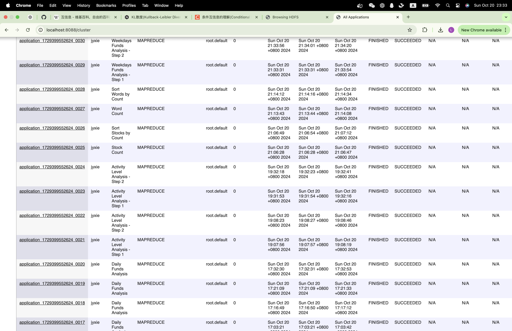

# I.设计思路

## 任务1：每日资金流入流出统计

## 任务2：星期交易量统计

## 任务3:用户活跃度分析

## 任务4:交易行为影响因素分析
根据mfd_bank_shibor 表，将银行一周利率Interest_1_W划分为不同的区间，统计每个区间下的日均资金流入和流出总量，分析利率与交易资金量之间的关系。绘图结果见InterferingFactors/process.ipynb，初步得到的规律是：在一定范围内，随着银行利率升高，日均资金流入和流出的差额先升高再降低，说明这项指标不仅仅和银行利率有关，可能还和和银行利率变动同时的经济局势变动有关。

# II.程序运行结果
对task1-task3分别运行：

hadoop jar DailyFundsAnalysis/target/DailyFundsAnalysis-1.0-SNAPSHOT.jar /user/jyxie/input/user_balance_table.csv /user/jyxie/output_lab2_1

hadoop jar WeekdaysFundsAnalysis/target/WeekdaysFundsAnalysis-1.0-SNAPSHOT.jar /user/jyxie/input/user_balance_table.csv /user/jyxie/output_temp2 /user/jyxie/output_lab2_2

hadoop jar ActivityLevelAnalysis/target/ActivityLevelAnalysis-1.0-SNAPSHOT.jar /user/jyxie/input/user_balance_table.csv /user/jyxie/output_temp3 /user/jyxie/output_lab2_3

运行成功的web截图： 
输出见output目录下文件

task4使用python进行处理，运行结果在InterferingFactors/process.ipynb

# III.不足与改进之处
1. 使用了临时输出路径，需要用户提供，用户使用不当容易出现错误，可以更改为根据时间戳自动生成，并在使用后及时删除
2. 可以增加更加详细的日志代码，在出现问题时便于调试
3. 没有验证输出路径是否已经存在，可以添加相关的处理